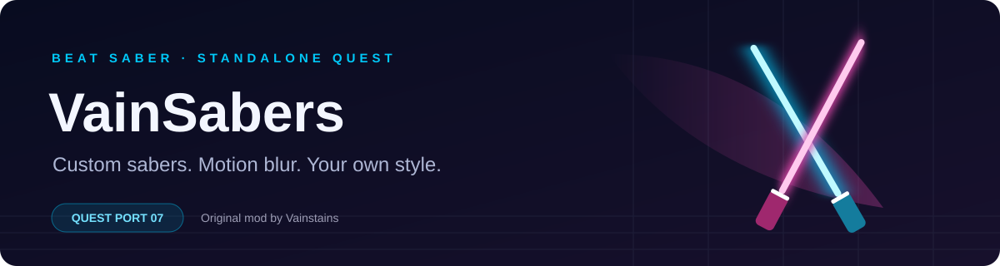

<div align="center">



**Custom sabers. Motion blur. Your own style.**

[](https://github.com/asdodod/vsq-port/releases/latest)
[](PATCH_NOTES.md)
[](https://github.com/Vainstains/VainSabers)


</div>

---

> 🤖 **THIS MOD WAS CREATED WITH AI.** AI was used to create and modify this Quest port. The original VainSabers mod, shaders, assets and presets are by **Vainstains**.

## ⚔️ What is VainSabers Quest?

A standalone Quest port of [VainSabers](https://github.com/Vainstains/VainSabers): build custom sabers from individual parts, tune motion blur and trails, and share presets from the in-game editor.

| | Make it yours |
| :--- | :--- |
| 🧩 **Geometry** | Simple tubes, Advanced rings, sprites and imported OBJ models |
| 🌊 **Motion blur** | Adjustable duration and softness |
| ✨ **Trails** | Blade and tip trails, gradients, textures, animated atlases and blade-trail vertex noise |
| 🎨 **Materials** | Color, glow, opacity, lit shading and angle gradients |
| 🛠️ **Editor** | Part transforms, mirroring, linking, previews and preset management |
| 📦 **Sharing** | JSON presets and .vainsaber exports with embedded models and textures |

## 📥 Install

1. Use a modded **Beat Saber 1.40.8_7379** installation with **Scotland2**.
2. Download **VainSabers.qmod** from [Releases](https://github.com/asdodod/vsq-port/releases/latest).
3. Install it with your Quest mod manager, such as [ModsBeforeFriday](https://mbf.bsquest.xyz/), including its required dependencies.
4. Restart Beat Saber and open **Mods → VainSabers** in the gameplay setup menu.
5. Enable VainSabers, choose a **Gameplay Saber** preset and play.

When updating from an old build, uninstall the old mod through your mod manager first, then install the new QMOD. Keep your preset folder.

## 📂 Install presets

Put presets in **/sdcard/VainSabers** — the **VainSabers** folder in the headset's internal-storage root, beside **Download**, **Movies** and **Pictures**.

Copy **.json** or **.vainsaber** files there, then press **Refresh presets**. External OBJ models and PNG/JPG/JPEG textures belong in the same folder. Self-contained .vainsaber exports include their resources.

**Gameplay Saber** selects your in-song preset. **Menu Display** controls menu sabers and lets you use a separate menu preset.

## 🛠️ Create & share

**Create new preset** creates an empty JSON preset and selects it under Gameplay Saber. Press **Edit**, then **+** to add your first part.

| Control | Action |
| :--- | :--- |
| **Tap a number** | Open the numeric keypad |
| **Hold a number + turn the controller horizontally** | Adjust its value |
| **Texture → …** | Edit atlas columns, rows, speed and direction |
| **Save** | Save the editable JSON preset with a backup |
| **Export** | Write a .vainsaber with embedded resources into /sdcard/VainSabers |
| **Hold Sabers** | Switch between held and static previews |

After a successful export, the button shows **Exported &lt;preset&gt;.vainsaber**. Export does not generate a PNG. **.vainsaber files are read-only** in the editor; use JSON for presets you want to keep editing. Duplicating a part preserves its name, for example **handle → handle Copy**.

## 💡 Add bloom

Install [**QuestBloom**](https://github.com/asdodod/QuestBloom) separately for configurable whole-game bloom and compatibility with VainSabers glow materials.

## ℹ️ PC compatibility

This port is based on the author's **PC 0.0.5** release and uses native C++ with Quest UI. Rendering and some editor behavior still differ from PC; this is not a complete 1:1 reproduction. Legacy plain-text presets are not supported — use JSON or .vainsaber.

**0.0.5** is the VainSabers version; **Quest port version 07** identifies this port update. Source changes may be newer than the latest published build.

## 🔧 Build from source

Requirements: **QPM**, **CMake 3.22+**, **Ninja**, **Android NDK r27** and **PowerShell 7**.

```powershell
qpm restore
$env:ANDROID_NDK_HOME = 'C:/Android/ndk/r27/android-ndk-r27-windows/android-ndk-r27'
pwsh ./scripts/build.ps1
pwsh ./scripts/createqmod.ps1
```

Output: **build/libvainsabers.so** and **VainSabers.qmod**. Dependencies are pinned in qpm.shared.json.

<details>
<summary><strong>🎮 Rebuild the Unity AssetBundle</strong></summary>

The **unity** project requires **Unity 2021.3.16f1** with **Android Build Support**. After editing shaders or assets, run **scripts/BuildAssetBundlesQuest.bat**; set **UNITY_PATH** if needed. The BAT copies the Android bundle into **assets/vs_assets**. Rebuild the native library afterwards.

</details>

## ❤️ Credits

- **Vainstains** — original VainSabers, shaders, assets, presets and PC UI.
- **QuestPackageManager, beatsaber-hook, custom-types, bs-cordl, Scotland2 and Quest-BSML contributors** — Quest tooling and UI.
- **Lauriethefish, danrouse and Bobby Shmurner** — Quest mod template.

The original mod and assets retain their authorship and licensing.

---

<div align="center">

**[Download](https://github.com/asdodod/vsq-port/releases/latest) · [Patch notes](PATCH_NOTES.md) · [Report a bug](https://github.com/asdodod/vsq-port/issues)**

</div>
